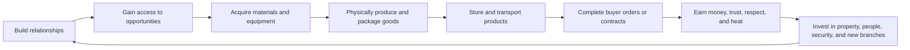
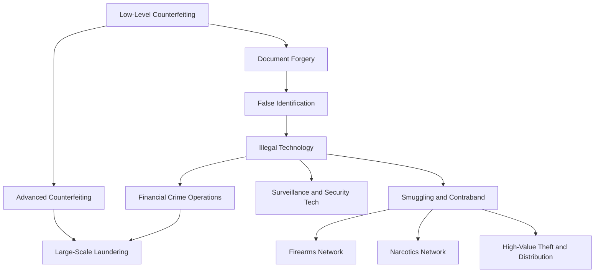

# Shadow Supply — Game Bible

> **Canonical release-vision document**
>
> **Bible version:** `1.0.0`  
> **Last updated:** `2026-07-14`  
> **Status:** Approved foundation  
> **Applies to:** Game design, narrative, world design, progression, economy, production, NPCs, factions, technical architecture, and release planning

---

## Document Authority

This document defines what **Shadow Supply is intended to become at release**.

It is the highest-level design authority in the repository. Implementation documents such as `PROJECT_CONTEXT.md`, `CURRENT_STATUS.md`, `SYSTEM_MAP.md`, milestone notes, scripts, prefabs, scenes, and save schemas describe the current build. They must move toward this vision unless this Bible is deliberately amended.

When a future idea conflicts with this document, the conflict must be resolved in one of two ways:

1. Change the implementation so it supports the Bible.
2. Approve a Bible amendment and record the change in `GAME_BIBLE_CHANGELOG.md`.

Core direction must never be silently changed through an isolated milestone, temporary implementation, AI-generated script, or asset limitation.

---

# 1. Game Identity

## 1.1 High concept

**Shadow Supply** is a single-player, first-person, open-world underground business and criminal-logistics simulator set in a divided island metropolis.

The player starts as a low-level counterfeiter operating from a rundown starter garage. Through physical production, deliveries, relationships, reputation, district influence, faction choices, property growth, recruitment, and calculated risk, the player can build a regional underground organization.

The game is not designed as a short linear campaign. It is designed as a persistent criminal-career sandbox where a single world can remain interesting for hundreds of hours.

## 1.2 Player fantasy

The player fantasy is:

> Start with almost nothing, become useful to the right people, learn how the city works, build a trusted network, create increasingly complex products and operations, survive the consequences of personal choices, and shape a criminal empire that reflects the player's relationships and decisions.

The player should feel that they earned access to the underworld through actions and people—not through a generic level-up screen.

## 1.3 Genre and presentation

- Single-player
- First-person
- Open-world
- Business and logistics simulation
- Relationship-driven role-playing
- Systemic crime sandbox
- Physical and interactive production
- Persistent world simulation
- Branching narrative
- Grounded, gritty, semi-realistic presentation

## 1.4 Tone

The tone is:

- Gritty
- Grounded
- Industrial
- Uneasy
- Character-driven
- Opportunistic
- Sometimes violent, but not a consequence-free power fantasy
- Darkly atmospheric without becoming permanently hopeless

The city must contain both rundown and desirable places. Wealth, stability, corruption, decay, industry, poverty, tourism, nightlife, suburbs, and forgotten infrastructure should exist near one another as they do in a large city.

---

# 2. Non-Negotiable Design Pillars

These pillars are core invariants. A feature that contradicts them requires a Bible amendment.

## Pillar 1 — Access comes through people

Major opportunities must come through NPC relationships, faction relationships, district reputation, or earned introductions.

A generic player level must never be the sole requirement for:

- Suppliers
- Employees
- Buyers
- Specialists
- Rare equipment
- Properties
- Major production branches
- Faction work
- Smuggling routes
- Protection
- High-level contracts

Money purchases an available opportunity. Money alone does not create access.

## Pillar 2 — Production is physical and interactive

Every real production recipe must contain manual interaction.

Recipes cannot be reduced to:

- Pressing one button
- Watching a passive timer
- Selecting an item from a menu and instantly receiving output

Recipe interactions may include:

- Dragging parts
- Ordered placement
- Tool use
- Tightening
- Drilling
- Wiring
- Folding
- Cutting
- Printing
- Inspection
- Taping
- Sealing
- Sorting
- Calibration
- Quality checks
- Packaging

Automation may become available later, but it expands the organization rather than deleting the player's ability to perform the work personally.

## Pillar 3 — The story is not the end of the game

Narrative arcs introduce characters, factions, conflicts, and opportunities. Completing major storylines must not exhaust the simulation.

After story arcs conclude, the world must continue producing:

- Demand changes
- Supplier problems
- Rival expansion
- Investigations
- Employee issues
- Faction disputes
- Property threats
- New contracts
- Market shortages
- New contacts
- Long-term strategic decisions

The game must remain playable and meaningful after credits or major narrative conclusions.

## Pillar 4 — Choices open doors and close others

The player should not experience every alliance, outcome, supplier, employee, and production route in one perfect playthrough.

Important choices must create lasting consequences.

Working with one faction may:

- Block a rival relationship
- Change district access
- Alter prices
- Create enemies
- Change available employees
- Unlock a different production route
- Change future missions
- Change who controls an area

There must not be a universally correct route that grants everything.

## Pillar 5 — A new world must be materially different

A new save is not merely the same content with zero money.

World variation may change:

- Faction control
- Faction alliances
- Supplier availability
- NPC traits
- Buyer preferences
- Police priorities
- Market prices
- Property availability
- Event timing
- Betrayals
- Introductions
- Mission chains
- Production unlock routes

The handcrafted map remains recognizable, but its criminal ecosystem changes.

## Pillar 6 — Grind must create stories

Shadow Supply is intentionally grind-heavy, but repetition must serve progression.

Good grind creates:

- Relationships
- Reputation
- Operational knowledge
- Better routes
- Market awareness
- Property growth
- Employee development
- Risk
- Personal history

Bad grind only inflates quantities or wastes time without changing the player's decisions.

## Pillar 7 — The world remembers

The game must preserve meaningful history.

NPCs, factions, districts, employees, properties, investigations, and markets should remember important actions. A betrayal cannot be erased by repeatedly choosing friendly dialogue.

## Pillar 8 — Physical systems matter

Equipment, power, storage, movement, vehicles, packaging, deliveries, security, and space must matter physically in the world.

Examples:

- A machine requires a real power connection.
- A plug occupies a specific outlet socket.
- A cable has limited reach.
- Furniture occupies usable space.
- A delivery physically arrives.
- Finished products exist on the workstation.
- Storage capacity is visible and limited.
- Security equipment depends on power.

---

# 3. Long-Term Player Experience

## 3.1 Target playtime

A committed player should be able to put **300 or more hours into one save** without the game becoming a solved checklist.

Long playtime must come from interacting systems, not an artificially stretched campaign.

## 3.2 Time horizons

### Opening hours: survival and credibility

The player:

- Learns the starter district
- Operates from the garage
- Performs basic counterfeiting work
- Meets initial buyers and contacts
- Builds first impressions
- Buys materials in small quantities
- Performs production manually
- Makes personal deliveries
- Learns police and district behavior
- Struggles with clean and dirty cash

### Early career: specialization

The player:

- Builds rapport and trust with recurring NPCs
- Gains district respect
- Improves product quality
- Unlocks document and identity work
- Gains access to better tools
- Purchases or rents a second property
- Develops a reliable supplier network
- Encounters first meaningful faction choices

### Midgame: organization

The player:

- Operates multiple properties
- Runs multiple production branches
- Recruits employees
- Manages wages and loyalty
- Uses vehicles for logistics
- Controls delivery routes
- Handles shortages and investigations
- Chooses allies and enemies
- Begins influencing district markets

### Late game: regional operation

The player:

- Coordinates production networks
- Manages specialists and managers
- Negotiates with factions
- Defends properties and routes
- Handles major law-enforcement pressure
- Launders large amounts of money
- Manipulates supply and demand
- Faces sabotage, betrayal, and succession problems
- Chooses whether to cooperate, dominate, or remain independent

### Endgame and post-story

The game continues through:

- Dynamic market shifts
- New faction leaders
- Rivals filling power vacuums
- Employee ambitions
- High-risk contracts
- Investigations
- Long-term territory pressure
- Property expansion
- Prestige operations
- Rare production opportunities
- World events

There is no state where the player has permanently solved every problem.

---

# 4. Starting Premise

The player begins as a **low-level counterfeiter**.

They have:

- A rundown modular starter garage
- Basic included furniture and equipment
- A small amount of money
- Limited materials
- A ShadowOS phone
- No established criminal reputation
- No trusted employees
- Few buyers
- Weak supplier access
- Minimal district influence
- Limited technical knowledge

The starter garage is an exception to normal property rules. It includes enough equipment to teach the core game. Later hideouts and businesses generally begin empty and require the player to purchase, deliver, place, power, and secure their own equipment.

---

# 5. Core Gameplay Loop



The loop is intentionally multi-layered.

A completed transaction may reward:

- Dirty cash
- Clean cash
- Personal rapport
- Professional trust
- Respect
- District reputation
- Industry reputation
- Faction standing
- New information
- Introductions
- Employee candidates
- Supplier access
- New property opportunities
- Heat
- Evidence
- Rival attention

---

# 6. Progression Architecture

## 6.1 Two parallel progression models

Shadow Supply uses two parallel models.

### Organizational scale

The organization may progress through the following broad identity:

**Runner → Dealer → Supplier → Organizer → Crew Leader → Regional Operator → Underground Kingpin**

This describes the scale of the player's operation, not a conventional character level.

### Industry path

The player starts in counterfeiting and branches through relationships, equipment, skills, districts, and faction access.



This diagram describes a design direction, not a promise that every branch is available through one route or in every world.

## 6.2 No universal unlock level

Unlocks should evaluate combinations such as:

- Overall respect
- District respect
- Industry reputation
- NPC trust
- NPC rapport
- NPC respect
- Faction standing
- Skill
- Knowledge flags
- Property requirements
- Equipment requirements
- Financial requirements
- Story choices
- Rival exclusions
- Introduction requirements
- Heat or investigation state

Example supplier gate:

```text
Personal Trust: 45+
Industrial District Respect: 20+
Introduction from an existing contact
No active alliance with supplier's enemy
One successful trial order
```

Example employee gate:

```text
Personal Rapport: 35+
Professional Respect: 25+
Reliable weekly income
Available workstation
Safe property
Completed personal favor
```

---

# 7. Reputation and Relationship Systems

## 7.1 Overall respect

Overall respect represents how seriously the broader underworld takes the player.

It influences:

- Major introductions
- Property access
- Contract scale
- Faction attention
- Specialist recruitment
- Negotiation credibility
- Regional opportunities

Overall respect must not replace local or personal relationships.

## 7.2 District respect

Each district tracks the player independently.

District respect affects:

- Local buyers
- Supplier willingness
- Property listings
- Local prices
- Street information
- Recruitment
- Rival aggression
- Police attention
- Faction influence
- Mission availability

A player may be respected in one district and unknown or hated in another.

## 7.3 Industry reputation

Each production and business branch has separate reputation.

Examples:

- Counterfeiting
- Forged documents
- Identity work
- Illegal technology
- Smuggling
- Firearms
- Narcotics
- Financial crime
- Laundering
- Distribution

High counterfeiting reputation does not automatically make the player trusted in another industry.

## 7.4 NPC relationship dimensions

Important NPCs track multiple dimensions.

### Rapport

How personally comfortable the NPC feels around the player.

Affected by:

- Conversation
- Shared experiences
- Personal favors
- Remembered details
- Gifts appropriate to the character
- Respectful treatment
- Time spent together

### Trust

Whether the NPC believes the player is reliable and safe.

Affected by:

- Completing agreements
- Paying debts
- Arriving on time
- Protecting information
- Avoiding reckless exposure
- Keeping promises
- Refusing betrayal

### Respect

Whether the NPC considers the player capable, influential, and competent.

Affected by:

- Product quality
- Operational success
- Handling pressure
- District influence
- Negotiation
- Technical skill
- Defeating or outmaneuvering rivals

### Loyalty

Primarily used for employees, partners, and close allies.

Affected by:

- Wages
- Profit sharing
- Safety
- Recognition
- Promotions
- Protection
- Fair treatment
- Faction compatibility
- How failures are handled

### Fear

Some NPCs may comply because they fear the player.

Fear can create short-term obedience but should increase:

- Betrayal risk
- Informant risk
- Employee turnover
- Rival cooperation
- Sabotage
- Hidden resentment

## 7.5 Relationship states shown to the player

The game may use numbers internally, but the player primarily sees descriptive states:

- Unknown
- Acquaintance
- Familiar
- Friendly
- Trusted
- Close Ally
- Loyal
- Cautious
- Suspicious
- Resentful
- Afraid
- Hostile

ShadowOS may show context such as:

```text
MARCUS VALE

Relationship: Trusted Contact
Professional Opinion: Respects your work
Current Concern: Increased police attention
Known Connections: East Harbor Logistics
```

## 7.6 NPC memory

Important NPCs remember meaningful actions.

Memory categories include:

- Paid fairly
- Paid late
- Debt unpaid
- High-quality order
- Low-quality order
- Arrived late
- Protected during danger
- Abandoned during danger
- Threatened
- Lied to
- Betrayed
- Helped a friend
- Hurt a friend
- Worked with an enemy
- Shared profit
- Took credit
- Kept a secret
- Exposed them to police
- Repeatedly treated them well

Memories influence future dialogue, trust changes, prices, referrals, recruitment, and betrayal.

Major negative memories require meaningful repair and cannot be erased through dialogue spam.

## 7.7 Relationship maintenance

Weak professional relationships may decay through long neglect.

Strong personal bonds should be more stable.

Maintenance may involve:

- Contact
- Work
- Favors
- Protection
- Fair payments
- Social interaction
- Information sharing

Relationship maintenance must create decisions, not become a daily chore for every NPC.

---

# 8. NPC Roles

## 8.1 Buyers

Buyers are persistent characters, not disposable vending machines.

Each buyer may have:

- Product interests
- Quality expectations
- Quantity limits
- Price tolerance
- Risk tolerance
- Schedule
- Preferred meeting locations
- District ties
- Faction ties
- Personal history
- Referral network

Buyer development unlocks:

- Larger orders
- Better prices
- Flexible deadlines
- Specialized demand
- Referrals
- Emergency work
- Protection
- Information
- Access to other districts

## 8.2 Suppliers

Suppliers are characters with needs, schedules, risks, and relationships.

Trust may unlock:

- Better prices
- Larger quantities
- Higher-quality materials
- Credit
- Rare inventory
- Emergency deliveries
- Private stock
- Introductions
- Warnings about shortages or police activity

Mistreatment may cause:

- Delays
- Higher prices
- Reduced quality
- Withheld stock
- Information leaks
- Fake promises
- Rival cooperation

## 8.3 Employees

Employees must be recruited through the world.

Sources include:

- Referrals
- Existing contacts
- Former buyers
- Faction introductions
- Personal side stories
- Employees recommending friends
- District social locations
- Rival organizations
- People the player helped

Employees have:

- Skills
- Experience
- Personality
- Reliability
- Loyalty
- Ambition
- Fear
- Morale
- Schedule preferences
- Wage expectations
- Criminal history
- Faction ties
- Personal relationships
- Risk tolerance

Possible employee traits:

- Skilled but unreliable
- Loyal but inexperienced
- Fast but careless
- Honest but expensive
- Cheap but likely to steal
- Excellent driver with police attention
- Technician tied to a rival faction
- Calm under pressure
- Panics during raids
- Wants profit sharing
- Wants authority
- Wants protection for family

Employees may:

- Improve
- Demand raises
- Request promotion
- Become managers
- Recruit others
- Steal
- Sabotage
- Inform
- Defect
- Become loyal long-term partners

A hiring menu may organize known candidates, but candidates must first be discovered and persuaded through relationships.

## 8.4 Specialists

Specialists unlock advanced operations.

Examples:

- Printer technician
- Document expert
- Electronics specialist
- Logistics coordinator
- Mechanic
- Security installer
- Accountant
- Laundering contact
- Smuggler
- Chemist
- Machinist
- Corrupt official
- Attorney or fixer

Specialists should often require personal story completion, strong trust, specialized reputation, and suitable working conditions.

---

# 9. Factions

## 9.1 Faction purpose

Factions create competing access routes, protection, risk, territory, and narrative consequences.

Faction types may include:

- Street organizations
- Port smugglers
- Industrial crews
- Financial-crime networks
- Organized crime families
- Motorcycle groups
- Corrupt business networks
- Political or official corruption rings
- Independent brokers
- Prison-connected groups
- Technology-focused crews

## 9.2 Faction relationships

Faction standing may include:

- Unknown
- Tolerated
- Useful
- Trusted
- Allied
- Dependent
- Suspicious
- Rival
- Enemy

Faction standing is influenced by:

- Work completed
- Territory
- Relationships with leaders
- Cooperation with enemies
- Contract failures
- Public disrespect
- Protection
- Information
- Tribute
- Market interference

## 9.3 Faction consequences

Faction decisions may change:

- Supplier access
- Buyer access
- District safety
- Property availability
- Employee candidates
- Prices
- Mission chains
- Smuggling routes
- Police information
- Rival attacks
- Protection costs
- Story outcomes
- Production unlocks

## 9.4 Independent route

The player should be able to reject major alliances and build an independent network.

Independence must be possible but difficult.

It may require:

- Higher costs
- More personal work
- Neutral relationships
- Own logistics
- Own security
- Carefully managed territory
- Alternative specialists

Independence is not the universally best route. It trades faction support for control and flexibility.

---

# 10. Narrative Structure

## 10.1 Story philosophy

Shadow Supply uses branching character and faction arcs inside a persistent sandbox.

The narrative should:

- Introduce systems naturally
- Create emotional stakes
- Force meaningful choices
- Change relationships
- Open and close opportunities
- Produce world-state changes
- Continue generating consequences after an arc ends

## 10.2 No single perfect path

A player should not be able to:

- Ally with every faction
- Recruit every specialist
- Unlock every secret route
- Complete every exclusive arc
- Keep every NPC alive and loyal
- Control every district without sacrifice

## 10.3 Story outcomes

Story choices may affect:

- Leadership changes
- Arrests
- Deaths
- Betrayals
- District control
- Supplier survival
- Employee availability
- Property access
- Police strategy
- Market structure
- Faction alliances
- Future world events

## 10.4 Ending philosophy

Major narrative arcs may have endings, but the save continues.

The player's long-term outcome is represented by:

- Organization structure
- Surviving relationships
- Enemies
- District influence
- Properties
- Employees
- Production branches
- Reputation
- Investigation pressure
- Personal choices

The true ending is the history created by the save.

---

# 11. Production and Crafting

## 11.1 Starting branch: counterfeiting

The release opening should focus on low-level counterfeiting.

The player gradually gains access to:

- Better paper or material stock
- Printing equipment
- Cutting tools
- Inspection tools
- Packaging
- Distribution contacts
- Document work
- False identification
- Specialized technology

All processes must remain fictionalized and gameplay-focused. The game must not provide real-world operational instructions for committing crimes.

## 11.2 Production interaction rule

Each recipe must define:

- Station
- Power requirement
- Required tools
- Consumable inputs
- Manual steps
- Error conditions
- Quality factors
- Output
- Packaging
- Storage requirements
- Risk
- Skill influence

## 11.3 Shared interaction library

Future recipes should use reusable interaction types.

Examples:

- Click tool
- Drag item
- Place item in target
- Rotate item
- Align item
- Hold action
- Repeat action
- Follow ordered steps
- Match a visual
- Inspect for defects
- Close container
- Seal package
- Apply label
- Calibrate machine
- Connect cable
- Load material
- Remove finished output

## 11.4 Quality

Product quality may depend on:

- Material quality
- Material condition
- Player skill
- Station tier
- Station condition
- Tool quality
- Employee skill
- Mistakes
- Order of operations
- Speed
- Environment
- Recipe familiarity

Quality affects:

- Price
- Buyer trust
- Returns
- Referrals
- Reputation
- Heat
- Detection risk
- Future demand

## 11.5 Automation

Automation becomes available through employees, equipment, and organization growth.

Automation must introduce management tradeoffs:

- Wages
- Error rates
- Theft
- Maintenance
- Power use
- Quality variance
- Noise
- Evidence
- Scheduling
- Supervision
- Employee loyalty

The player may always choose to perform a recipe personally for control, quality, or enjoyment.

---

# 12. Economy

## 12.1 Cash types

The game distinguishes:

- **Dirty cash:** obtained through underground activity
- **Clean cash:** usable for legitimate expenses and low-risk purchases

## 12.2 Laundering

Laundering is a network and property system, not a single conversion button.

Methods may involve:

- Front businesses
- Cooperative NPCs
- Financial contacts
- Properties
- Fees
- Capacity
- Delay
- Investigation risk
- Relationship requirements

## 12.3 Market simulation

Prices and availability are affected by:

- District demand
- Supply shortages
- Faction control
- Police pressure
- World events
- Supplier relationships
- Product quality
- Player volume
- Rival activity
- Transport disruption

## 12.4 Grind philosophy

Progression should require sustained work, but each stage must add decisions.

The player should grind toward:

- A trusted relationship
- Better production consistency
- Larger contracts
- New districts
- Improved logistics
- A specialist
- A property
- A route
- A reputation milestone
- A faction outcome

The game should avoid requirements that only say “repeat the exact same order 100 times” without variation.

---

# 13. Properties

## 13.1 Property types

Potential properties include:

- Starter garage
- Apartments
- Back rooms
- Small workshops
- Storage units
- Warehouses
- Retail fronts
- Rural buildings
- Dock facilities
- Offices
- Industrial plants
- Safehouses
- Luxury residences

## 13.2 Property function

Properties provide:

- Production space
- Storage
- Security
- Employee capacity
- Delivery access
- Parking
- Laundering
- District presence
- Prestige
- Legal cover
- Risk

## 13.3 Starter garage exception

The starter garage includes a basic default setup.

Future properties should normally require the player to purchase and install:

- Furniture
- Workstations
- Storage
- Lighting
- Outlets
- Power strips
- Security
- Keypads
- CCTV
- Packaging areas
- Employee stations

## 13.4 Physical infrastructure

Properties may have:

- Electrical capacity
- Circuits
- Water or utility requirements
- Noise
- Visibility
- Access points
- Security levels
- Delivery restrictions
- Neighbors
- Landlord rules
- Inspection risk

---

# 14. Electrical and Equipment Systems

Physical power is a core Shadow Supply mechanic.

Equipment must consider:

- Plug
- Cable
- Cable length
- Outlet socket
- Circuit
- Breaker
- Load
- Capacity
- Overload
- Powered state
- Saved connection
- Placement restrictions

Future additions include:

- Extension cords
- Four-socket power strips
- Cable reels
- Generators
- Battery systems
- Damaged cords
- Sparks
- Short circuits
- Illegal power taps
- Property service upgrades

Security, lighting, computers, production stations, and doors may depend on power.

---

# 15. Inventory, Storage, and Logistics

## 15.1 Inventory

Items track:

- Stable ID
- Quantity
- Quality
- Condition
- Category
- Value
- Held visual
- World visual
- Storage behavior

## 15.2 Physical storage

Storage should become visible in the world.

Examples:

- Shelves
- Cabinets
- Lockers
- Crates
- Pallets
- Vehicle cargo
- Hidden compartments

## 15.3 Deliveries

Purchased items and furniture should arrive physically.

Delivery considerations:

- Location
- Time
- Supplier
- Size
- Vehicle requirement
- Theft risk
- Police observation
- Combined shipments
- Uncollected persistence

## 15.4 Vehicles

Vehicles support:

- Personal travel
- Deliveries
- Storage
- Smuggling
- Employee assignments
- Route planning
- Police attention
- Maintenance
- Ownership
- Customization

Vehicles should not replace the need for properties and logistics planning.

---

# 16. Heat, Evidence, and Law Enforcement

## 16.1 Heat

Heat represents attention, not a simple wanted meter.

Heat may exist at several levels:

- Immediate incident heat
- District attention
- Industry attention
- Property suspicion
- Organization investigation
- Personal law-enforcement attention

## 16.2 Evidence

Possible evidence sources include:

- Witnesses
- CCTV
- Vehicle descriptions
- Delivery patterns
- Phone records
- Informants
- Employee mistakes
- Property utilities
- Noise
- Repeated routes
- Seized products
- Financial irregularities

## 16.3 Investigation

Investigations may grow over time.

Possible consequences:

- Surveillance
- Stops
- Informants
- Search warrants
- Raids
- Supplier arrests
- Buyer disappearance
- Employee questioning
- Property closure
- Asset seizure

Law enforcement should adapt to the player's habits.

## 16.4 Combat philosophy

Violence may occur, but it is dangerous and consequential.

Combat should:

- Create witnesses
- Increase heat
- Damage relationships
- Change faction responses
- Risk injury or loss
- Escalate investigations

Shadow Supply is an empire and logistics simulation first, not a consequence-free shooter.

---

# 17. ShadowOS and User Interface

ShadowOS is the player's central device interface.

Planned functions include:

- Contacts
- Messages
- Buyer orders
- Supplier listings
- Property listings
- Employees
- Missions
- Map
- Notes
- Finances
- Security camera viewing
- Remote access
- Reputation clues
- Relationship information
- District information

The interface direction is:

- Dark industrial
- Amber
- Red
- Teal
- Minimal obstruction during normal play
- Clear physical-world feedback
- Diegetic where practical

The game should not expose every hidden relationship number. It should provide readable descriptions and clues.

---

# 18. World and Map Bible

## 18.1 World concept

The world is a bounded island metropolis and surrounding satellite islands.

The setting combines:

- Dense urban districts
- Rundown neighborhoods
- Working-class areas
- Industrial zones
- Docks
- Rail
- Warehouses
- Commercial strips
- Suburbs
- Wealthy neighborhoods
- Rural edges
- Water routes
- Hidden infrastructure

The island structure creates a believable natural boundary while supporting bridges, ferries, boats, docks, coastlines, cliffs, and smuggling routes.

## 18.2 Boundary philosophy

The player must understand why the world ends.

Preferred boundaries:

- Open water
- Cliffs
- Port security zones
- Damaged bridges
- Fenced infrastructure
- Mountains
- Marsh
- Government-controlled crossings
- Distant skyline or mainland
- Heavy shipping lanes

Avoid obvious invisible walls in ordinary traversal areas.

Water boundaries may use:

- Deep water
- Current
- Restricted navigation
- Coast guard response
- Boat fuel
- Weather
- Out-of-bounds recovery

## 18.3 Master layout

The approved high-level layout uses several connected landmasses.

### Main island

The largest landmass contains:

- Starter district
- Dense rundown neighborhoods
- Central commercial core
- Warehouse and rail district
- Mixed residential areas
- Major road network
- Several properties
- Initial faction presence

### Eastern island

A long north-south island contains:

- Port operations
- Industrial shoreline
- Working-class residential areas
- Wealthier northern areas
- Smuggling access
- Secondary commercial zone
- Long-distance travel routes

### Western island

A smaller older landmass contains:

- Aging neighborhoods
- Small businesses
- Coastal roads
- Early buyers
- Tight faction influence
- Lower-cost properties
- Limited bridge access

### Southern satellite island

A smaller landmass contains:

- Rural or semi-rural properties
- Storage
- Farms
- Logistics
- Hidden routes
- Boat access
- Lower police density
- Longer travel times

### Outer water and minor locations

The surrounding water may include:

- Small docks
- Restricted port areas
- Abandoned structures
- Boat drops
- Hidden coves
- Infrastructure islands
- Future expansion space

## 18.4 District plan

District names below are working names. Their gameplay identity is core; names may change without changing the Bible.

| Working district | Identity | Primary gameplay |
|---|---|---|
| **Blackwater South** | Rundown mixed industrial neighborhood and starter area | Starter garage, early buyers, basic counterfeiting, low-cost materials |
| **The Cut** | Dense low-income residential district | Street buyers, recruitment, gang influence, high witness density |
| **Ironworks** | Warehouses, rail yard, scrapyards, factories | Equipment, industrial suppliers, machinists, larger properties |
| **Old Harbor** | Aging docks and waterfront industry | Smuggling, maritime deliveries, port factions, high-value contraband |
| **Central Ward** | Downtown, offices, nightlife, finance | Wealthy buyers, laundering, surveillance, expensive property |
| **Eastgate** | Mixed commercial and middle-income residential | Legitimate fronts, employees, balanced police presence |
| **North Heights** | Wealthy hills, gated homes, premium businesses | High-value demand, social contacts, heavy security |
| **Marshline** | Wetlands, utility corridors, scattered industry | Hidden routes, rural storage, generators, low visibility |
| **West Borough** | Older town center and coastal neighborhoods | Independent contacts, small properties, local loyalty |
| **South Ferry** | Satellite island logistics and rural edge | Storage, boat routes, discreet operations, long transport times |

## 18.5 District contrast

Every district should combine safety, risk, opportunity, and identity.

A rundown district is not merely “bad.” It may offer:

- Loyalty
- Cheap property
- Informal information
- Hidden routes
- Low-cost labor
- Community consequences

A wealthy district is not merely “good.” It may offer:

- High-value demand
- Better laundering
- Advanced technology
- Strong surveillance
- Private security
- Political pressure
- Expensive access

## 18.6 Roads and traversal

The road network should include:

- Major arteries
- Industrial service roads
- Alleys
- Residential streets
- Highways
- Bridges
- Parking lots
- Loading areas
- Rail crossings
- Waterfront roads
- Rural roads

Travel time must create logistics decisions without becoming empty commuting.

## 18.7 Bridges

Bridges are strategic chokepoints.

They may affect:

- Police checkpoints
- Faction control
- Toll or access
- Delivery risk
- Route planning
- Traffic
- Closures
- Story events

Alternative water or underground routes become valuable when bridges are dangerous.

## 18.8 Rail

Rail supports:

- World atmosphere
- Industrial identity
- Physical barriers
- Freight schedules
- Smuggling
- Deliveries
- Hidden access
- Future train-related events

## 18.9 Underground infrastructure

Potential underground routes include:

- Sewers
- Utility tunnels
- Maintenance corridors
- Abandoned transit
- Service basements
- Storm drains

Underground routes must have costs:

- Limited access
- Flooding
- Navigation difficulty
- Faction control
- Security
- Equipment requirements

## 18.10 Water gameplay

Water routes support:

- Boats
- Coastal delivery
- Port operations
- Hidden coves
- Island logistics
- Smuggling
- Police patrols
- Weather risk

## 18.11 Properties across the map

Property distribution should create progression.

Early properties:

- Cheap
- Small
- Poor security
- Limited power
- Limited delivery access

Late properties:

- Larger
- Expensive
- Better infrastructure
- More visible
- Higher operating costs
- Greater employee capacity
- Greater investigation risk

## 18.12 Dynamic district state

Districts may change through:

- Faction control
- Police campaigns
- Economic growth
- Business closures
- Player investment
- Violence
- Shortages
- Leadership changes
- Story outcomes

The physical map remains handcrafted, but its active economy and power structure evolve.

---

# 19. World Simulation

## 19.1 Dynamic systems

The world may simulate:

- Buyer demand
- Supplier stock
- Material prices
- Faction control
- District tension
- Police activity
- Employee morale
- Rival growth
- Property risk
- World events
- Weather
- Day and night
- Traffic
- Deliveries
- Arrests
- Leadership changes

## 19.2 Long-term events

Examples:

- Supplier arrested
- Material shortage
- Rival price war
- New task force
- Informant discovered
- Employee theft
- Faction split
- Leadership death
- Harbor shutdown
- Bridge checkpoint
- Property inspection
- Buyer demand spike
- Blackout
- Vehicle theft
- Front business audit
- New smuggling route
- District unrest

Events should interact with current relationships and world state.

---

# 20. Replayability

## 20.1 World seed variation

A new world may vary:

- Starting faction influence
- District control
- NPC personalities
- NPC compatibility
- Supplier locations
- Buyer demand
- Employee candidates
- Police intensity
- Property availability
- Market conditions
- Story-event order
- Betrayal chances
- Secret routes
- Introduction networks

## 20.2 Handcrafted plus systemic

The city, major characters, and core stories may be handcrafted.

Replayability comes from recombining:

- Relationships
- Faction state
- Market state
- NPC traits
- World events
- Unlock routes
- Player choices

## 20.3 Distinct career histories

One save may become:

- A respected independent counterfeiting and technology network
- A faction-backed smuggling organization
- A financial-crime empire
- A violent territorial operation
- A logistics-focused supplier network
- A small but high-quality specialist organization

A new save should encourage a different identity.

---

# 21. Character and Customization

The player character is a visible modular character.

Long-term customization includes:

- Clothing
- Shoes
- Hair
- Facial hair
- Accessories
- Backpacks
- Equipment
- Gloves
- Faction-related appearance
- Wealth and status expression

Customization should connect to gameplay where appropriate:

- Carry capacity
- Concealment
- Social reactions
- Heat
- Employee perception
- Property access
- Weather

The player should be able to see their body in first person without obstructing gameplay.

---

# 22. Art and Audio Direction

## 22.1 Visual direction

Preferred:

- Realistic or semi-realistic assets
- Weathered materials
- Brick
- Concrete
- Steel
- Asphalt
- Industrial clutter
- Worn interiors
- Realistic proportions
- PBR materials
- LODs
- Grit balanced with readable lighting

Avoid for final close-range art:

- Strongly stylized low-poly assets
- PSX-style assets
- Incompatible asset scales
- Repeated generic clutter without purpose
- Unoptimized high-poly assets without LODs

## 22.2 Environmental storytelling

Properties and districts should communicate:

- Who lives there
- Who controls it
- What happened there
- What activity occurs there
- Whether it is improving or declining

## 22.3 Audio direction

Audio should emphasize:

- Electrical hum
- Machinery
- Distant traffic
- Trains
- Port sounds
- Rain
- Ventilation
- Fluorescent buzz
- Sirens
- Neighborhood ambience
- Physical interaction feedback

Music should support mood without overwhelming long play sessions.

---

# 23. Technical Design Principles

## 23.1 Engine direction

- Unity
- Universal Render Pipeline
- Unity Input System
- First-person
- Continuous open-world island/city
- Modular systems
- Persistent save data

## 23.2 Source of truth

The repository is the implementation source of truth.

Before modifying a system:

1. Inspect current scripts.
2. Inspect scenes and prefabs.
3. Inspect ScriptableObjects.
4. Inspect serialized fields.
5. Inspect save dependencies.
6. Preserve stable IDs.
7. Provide migrations when required.
8. Update documentation.

## 23.3 Save integrity

Long saves are central to the game.

Systems must support:

- Stable persistent IDs
- Versioned save schemas
- Migration
- Partial-state restoration
- World-state restoration
- Relationship history
- Production state
- Property state
- Employee state
- Electrical connections
- Market state
- Faction state
- Investigation state

A system that works only in a new save is not release-ready.

## 23.4 Modular architecture

Core systems must remain reusable across:

- Properties
- Districts
- Recipes
- NPCs
- Factions
- Vehicles
- Stations
- World seeds

## 23.5 Physical-system preservation

Do not replace physical mechanics with simplified menu equivalents unless the Bible is amended.

Examples that must remain physical:

- Plugging in machines
- Outlet sockets
- Production steps
- Furniture placement
- Deliveries
- Finished outputs
- Storage
- Security installation

---

# 24. Release-Vision Acceptance Tests

A release-direction feature should answer yes to most relevant questions.

## Relationships

- Does access come through a believable person or network?
- Can the NPC remember meaningful behavior?
- Can the relationship improve, decay, or break?
- Does the relationship unlock something specific?
- Can another playthrough reach the opportunity differently?

## Production

- Is the recipe physically interactive?
- Does equipment and power matter?
- Can mistakes affect outcome?
- Is quality meaningful?
- Does finished output physically exist?
- Can employees later perform or assist with the process?

## World

- Does the feature belong to a district?
- Does it respond to faction or police state?
- Does it create logistics decisions?
- Can it persist in save data?
- Can world variation change it?

## Progression

- Is the unlock based on more than a generic level?
- Does progression create a new decision?
- Does it deepen the organization?
- Does it avoid making old gameplay irrelevant?

## Replayability

- Can a choice close a route?
- Can another route replace it?
- Can the world state alter the result?
- Does the player's history matter?

---

# 25. Current Development Direction

The current confirmed foundation includes:

- First-person controller
- Inventory and hotbar
- Save and load
- Furniture ownership and placement
- Modular character
- Modular starter garage
- Physical garage power
- Plug dragging
- Outlet sockets
- Breaker circuits
- Cable floor following
- Interactive workbench production
- Manual part placement
- Package closing
- Workbench targeting refinements
- Fixture-origin garage lighting

The next planned gameplay milestone is the **first persistent buyer relationship and order**.

That milestone must introduce:

- A recurring buyer NPC
- Rapport
- Trust
- Respect
- Product preference
- Quality expectation
- Order acceptance
- Physical handoff
- Relationship-based future access
- Referral potential

The first buyer must demonstrate the game's relationship-first progression philosophy.

---

# 26. Core Change-Control Policy

## 26.1 Versioning

The Bible uses semantic versions.

- **Major:** changes the identity or a non-negotiable pillar
- **Minor:** adds or significantly revises a major design area
- **Patch:** clarifies wording without changing intent

## 26.2 Required amendment record

Every approved change must record:

- Date
- Bible version
- Requested change
- Reason
- Affected sections
- Affected systems
- Save or migration implications
- Whether previous milestones conflict
- Approval status

## 26.3 Core change template

```md
## Bible Amendment

**Date:** YYYY-MM-DD  
**Version:** X.Y.Z  
**Status:** Proposed / Approved / Rejected

### Change

Describe the proposed core change.

### Reason

Explain why the existing direction is insufficient.

### Affected Bible Sections

- Section
- Section

### Implementation Impact

- Systems
- Scenes
- Prefabs
- Data
- Saves

### Compatibility

Explain whether existing content remains valid.

### Decision

Record the final approved direction.
```

## 26.4 Required repository updates

When a core change is approved:

1. Update this Bible.
2. Update `GAME_BIBLE_CHANGELOG.md`.
3. Update `PROJECT_CONTEXT.md` if the high-level concept changed.
4. Update `SYSTEM_MAP.md` if system responsibilities changed.
5. Update `CURRENT_STATUS.md` if the active roadmap changed.
6. Update save and migration documentation when applicable.
7. Review existing milestones for conflicts.

---

# 27. Final Vision Statement

Shadow Supply is not a game where the player fills one experience bar, purchases every upgrade, completes a final mission, and leaves.

It is a persistent criminal-career simulation built around:

- People
- Trust
- Reputation
- Physical work
- Logistics
- Consequences
- Properties
- Employees
- Factions
- Districts
- Risk
- Memory
- Choice

The player does not unlock the underworld because the game announces that they reached the correct level.

They unlock it because someone knows them, someone trusts them, someone fears them, someone respects their work, or someone needs what they have built.

Every system should help create a world in which a 300-hour save feels like a personal history—and a new save feels like a different life.
